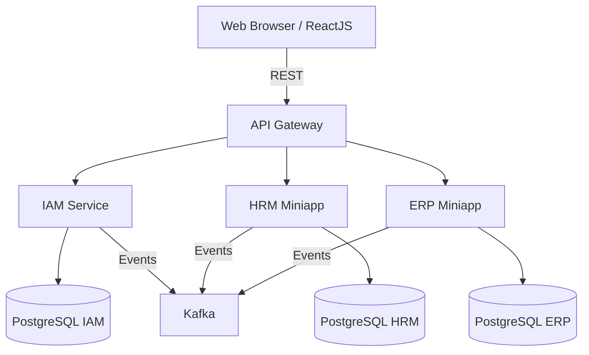

# Enterprise Platform

## Tổng quan
Enterprise Platform là hệ sinh thái nền tảng doanh nghiệp (microservices) gồm **platform services dùng chung** và các **miniapp nghiệp vụ** (`applications/`).

Mục tiêu vận hành tài liệu + AI pipeline:

**`requirement/` (txt + ảnh theo feature) → docs kỹ thuật → implement code → testing`**

Xem chi tiết: [`FEATURE-LIFECYCLE.md`](FEATURE-LIFECYCLE.md).
**Copy-paste prompts:** [`PROMPTS.md`](PROMPTS.md).

## Cấu trúc nền tảng
- **Backend:** Microservices với package gốc `com.cachesol.platform` (Xem: [`SOURCE-CODE-STRUCTURE.md`](SOURCE-CODE-STRUCTURE.md))
- **Frontend:** Mono-repo với **Mini App dạng Library** + Host Shell (Xem: [`MINI-APP-ARCHITECTURE.md`](MINI-APP-ARCHITECTURE.md))
- **Cấu trúc tài liệu:** Xem [`DOCUMENTATION-STRUCTURE.md`](DOCUMENTATION-STRUCTURE.md)

## Mục tiêu
- Chuẩn hóa phát triển phần mềm doanh nghiệp.
- Mở rộng dịch vụ độc lập (microservice, database-per-service).
- Tái sử dụng module nền (IAM, Notification, Workflow, …).
- Squad tự chủ triển khai từng miniapp/feature.

## Tech Stack
- **Backend:** Java Spring Boot 21
- **Frontend:** ReactJS + Ant Design 5
- **Messaging:** Apache Kafka
- **Database:** PostgreSQL (per service)
- **Infrastructure:** Docker, Kubernetes

## Kiến trúc Tổng quan


## Cấu trúc Thư mục
```text
enterprise-platform/
├── README.md
├── FEATURE-LIFECYCLE.md      # Luồng requirement → docs → code → test
├── SOURCE-CODE-STRUCTURE.md  # Cấu trúc source code (cập nhật v2: src/)
├── MINI-APP-ARCHITECTURE.md  # Kiến trúc Mini App
├── DOCUMENTATION-STRUCTURE.md# Cấu trúc tài liệu
├── AI_RULES.md
├── CONTRIBUTING.md
│
├── src/                      # ⭐ SOURCE CODE DUY NHẤT
│   ├── backend/
│   │   ├── applications/     # Microservices nghiệp vụ (HRM, ERP, Sales, ...)
│   │   ├── platform/         # Microservices nền tảng (IAM, Notification, Workflow, ...)
│   │   └── shared/           # Backend shared libs (shared-common, shared-messaging, shared-security)
│   └── frontend/
│       ├── apps/web-shell/
│       ├── mini-apps/
│       ├── shared/
│       └── design-system/
│
├── applications/             # CHỈ CHỨA docs / requirement / tests (KHÔNG có code)
│   ├── _templates/
│   ├── hrm/{docs, requirement, tests}
│   ├── erp/{docs, requirement, tests}
│   ├── sales/{docs, requirement, tests}
│
├── governance/               # Principles, ADR, standards, API, security, quality
├── agents/                   # 11 AI agents + PIPELINE-PROMPTS
├── skills/                   # Skills + enterprise aliases
└── workflows/                # YAML pipelines (feature, bugfix, release, ...)
```

**Nguyên tắc:**
- Toàn bộ source code nằm trong `src/` duy nhất — tách biệt hoàn toàn với docs/AI definitions.
- Backend code: `src/backend/{applications,platform,shared}/`. Java package gốc `com.cachesol.platform.*`.
- Frontend code: `src/frontend/{apps,mini-apps,shared,design-system}/`. Frontend package `@cachesol/*`.
- `applications/{name}/` ở root **chỉ** chứa `docs/`, `requirement/`, `tests/`.
- Mọi microservice backend **bắt buộc** có logging đầy đủ (access, audit, performance, error) — xem `SOURCE-CODE-STRUCTURE.md` §1.6.

## Luồng làm việc Feature (tóm tắt)
1. Tạo `applications/<miniapp>/requirement/<feature-id>/requirement.txt` + `images/`.
2. BA → `requirement-doc.md`.
3. Architect / API / UX → `docs/<feature-id>/`.
4. Backend + Frontend → `backend/`, `frontend/`.
5. Tester + Reviewers → `tests/` + `docs/.../reviews/`.
6. Orchestrator → release gate.

Workflow máy: [`workflows/feature-development.yaml`](workflows/feature-development.yaml).  
Hướng dẫn prompt: [`agents/PIPELINE-PROMPTS.md`](agents/PIPELINE-PROMPTS.md).

## Ví dụ đã có
- Feature mẫu HRM: [`applications/hrm/requirement/employee-profile/`](applications/hrm/requirement/employee-profile/)

## Hướng dẫn Navigate
| Bạn là… | Đọc trước |
|---------|-----------|
| Muốn chạy AI ngay | [`PROMPTS.md`](PROMPTS.md) |
| Stakeholder / PO | [`governance/requirements-guideline.md`](governance/requirements-guideline.md) |
| AI Agent | [`AI_RULES.md`](AI_RULES.md) + [`FEATURE-LIFECYCLE.md`](FEATURE-LIFECYCLE.md) |
| Kỹ sư mới | [`CONTRIBUTING.md`](CONTRIBUTING.md) |
| Architect | [`governance/architecture/principles.md`](governance/architecture/principles.md) |
