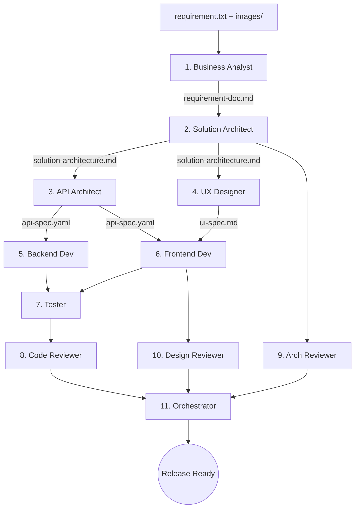

# Pipeline Phát Triển AI (PIPELINE-PROMPTS)

Hướng dẫn vận hành Multi-Agent cho **feature miniapp**: requirement → docs → code → test → release.

## 0. Input bắt buộc

```text
applications/<miniapp>/requirement/<feature-id>/
├── requirement.txt
└── images/
```

Xem [`FEATURE-LIFECYCLE.md`](../FEATURE-LIFECYCLE.md) và [`governance/requirements-guideline.md`](../governance/requirements-guideline.md).

## 1. Tổng quan Pipeline



## 2. Mapping bước → path artifact

Giả sử `miniapp=hrm`, `feature-id=employee-profile`:

| Bước | Agent | Output |
|------|-------|--------|
| 1 | BA | `applications/hrm/requirement/employee-profile/requirement-doc.md` |
| 2 | Solution Architect | `applications/hrm/docs/employee-profile/solution-architecture.md` |
| 3 | API Architect | `.../docs/employee-profile/api-spec.yaml`, `event-design.md` |
| 4 | UX Designer | `.../docs/employee-profile/ui-spec.md` |
| 5 | Backend | `applications/hrm/backend/` + `db-design.md` |
| 6 | Frontend | `applications/hrm/frontend/` |
| 7 | Tester | `applications/hrm/tests/employee-profile/test-report.md` |
| 8 | Code Reviewer | `.../docs/employee-profile/reviews/code-review-report.md` |
| 9 | Arch Reviewer | `.../reviews/architecture-review-report.md` |
| 10 | Design Reviewer | `.../reviews/design-review-report.md` |
| 11 | Orchestrator | `.../docs/employee-profile/pipeline-progress.md` |

Prompt chi tiết: `agents/<agent>/system-prompt.md`.  
Workflow YAML: [`workflows/feature-development.yaml`](../workflows/feature-development.yaml).

## 3. Cách chạy thủ công từng bước
1. Mở `agents/<agent>/system-prompt.md` → dán vào System Instructions.
2. Attach input files (đúng path ở bảng trên).
3. Prompt: `Thực hiện task theo system prompt. Ghi output đúng path FEATURE-LIFECYCLE.`
4. Lưu artifact → attach sang bước sau.

## 4. Template khởi động Orchestrator

```text
Kích hoạt pipeline feature miniapp.
miniapp: hrm
feature-id: employee-profile
requirement-path: applications/hrm/requirement/employee-profile/

Nhiệm vụ: đọc requirement.txt + images/, thiết lập pipeline tracker,
cập nhật requirement/_index.md, kích hoạt Business Analyst tạo requirement-doc.md,
sau đó chạy đủ 11 bước theo workflows/feature-development.yaml.
```

## 5. Shortcut Workflows
- **Bug fix:** `workflows/bug-fix.yaml`
- **API nhỏ:** API Architect → BE → FE → Tester
- **UI only:** UX → FE → Design Reviewer
- **Hotfix:** Dev → Code Reviewer (fast-track)

## 6. Skills
Agents dùng alias `skills/enterprise/*` — catalog tại [`skills/README.md`](../skills/README.md).

## 7. Prompt catalog (copy-paste)
Toàn bộ prompt sẵn dùng: [`../PROMPTS.md`](../PROMPTS.md).
