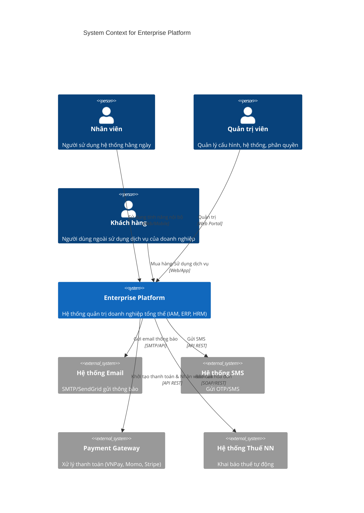

# System Context (C4 Level 1)

## Mô tả Hệ thống Enterprise Platform
Enterprise Platform là một nền tảng tích hợp toàn diện, đóng vai trò là "hệ điều hành số" cho toàn bộ doanh nghiệp. Hệ thống quản lý danh tính, phân quyền, nhân sự, quy trình làm việc, quản lý tài nguyên (ERP) và kết nối mượt mà với các đối tác hoặc hệ thống bên thứ 3.

## C4 System Context Diagram

## Danh sách External Actors
- **Nhân viên nội bộ:** Sử dụng tính năng HRM, ERP, Workflows.
- **Quản trị viên:** Quản lý IAM, cấu hình tham số hệ thống.
- **Khách hàng:** Tương tác với cổng thông tin bên ngoài.

## Danh sách External Systems tích hợp
- **Email/SMS Providers:** Cung cấp hạ tầng gửi tin (SendGrid, Twilio...).
- **Payment Gateways:** Xử lý thanh toán số.
- **Government Portals:** Hệ thống dịch vụ công, thuế.
- **Cloud Storage:** Lưu trữ file, hóa đơn, báo cáo (AWS S3, Azure Blob).

## Constraints & Assumptions (Ràng buộc và Giả định)
- **Assumptions:**
  - Doanh nghiệp có kết nối mạng ổn định tới các cloud services.
  - Người dùng có trình duyệt hiện đại (Chrome/Edge/Safari/Firefox bản mới nhất).
- **Constraints:**
  - Phải tuân thủ GDPR và các chuẩn bảo mật dữ liệu địa phương.
  - API Gateway phải xử lý được ít nhất 10,000 TPS.
  - Dữ liệu tài chính không được phép bị xóa (chỉ được soft delete).
